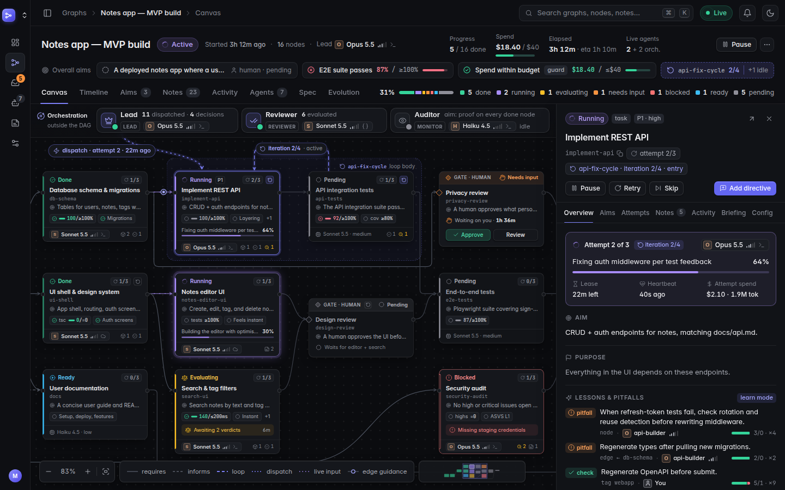

# Agent Graphs

**Construct, run, monitor, and audit the execution graphs that AI agents work through when they
build software.**

Agent Graphs turns an agent-orchestrated build into an explicit graph:
- Every node has an aim, a purpose, a prompt, acceptance aims, and a live status.
- Agents claim nodes, report progress, and attach evidence-backed notes annotated with the
  **model, thinking level, provider, and delivery mechanism** they used.
- Failed work iterates through **bounded failure-cycles** until it meets its aims or escalates to
  a human.
- **Orchestrators** supervise the whole graph from outside the task DAG.
- Humans watch it all live in the web UI, and steer through an **Inbox** and **directives** that
  agents acknowledge.

All state lives in the graph rather than in any one agent's context window. Work survives
compaction, crashes, and handoffs, every stage gets executed, and every "done" is backed by an
auditable, hash-chained record. Optionally, graphs can **learn from their own traces**: edge
guidance and pitfalls, lessons, and gated proposals, following *Procedural Graphs*
([docs/self-evolution.md](docs/self-evolution.md)).

<p align="center">
  
</p>

> **Status: M0, planning and foundation.** The design is complete and the monorepo scaffold is
> verified. Implementation starts with M1, the core engine. See [docs/PLAN.md](docs/PLAN.md).
> The screenshots come from the [design mockup](docs/design/ui-mockup.html), not the built UI.

## Quickstart (development)

Requirements: Node.js ≥ 22.12 and pnpm 10.

```bash
pnpm install
pnpm dev            # API server on :4747 + web UI on :5173 (proxying /api)
pnpm check          # lint + typecheck + license gate + tests
pnpm demo           # fresh server + simulated agents driving examples/graphs/notes-app.yaml
```

The CLI runs from source during development:

```bash
node packages/cli/bin/agraph.js serve     # start the server
node packages/cli/bin/agraph.js health    # check it is reachable
node packages/cli/bin/agraph.js --help    # the full command set (docs/agent-protocol.md §7.2)
```

To wire a repository for Claude Code (MCP server, hooks, and skill), see
[integrations/claude-code](integrations/claude-code/README.md).

## How agents use it

Agents connect over **MCP** (`agraph mcp`, for Claude Code and other MCP clients), the
**`agraph` CLI**, or plain **REST** (OpenAPI at `/api/v1/openapi.json`). The protocol is:

1. Claim a node.
2. Read its token-budgeted briefing.
3. Heartbeat while working.
4. Attach notes (proof, deliverables, findings, decisions, handoffs).
5. Submit against the node's aims.

Claude Code hooks automate heartbeats, re-inject the briefing after context compaction, and
prevent stopping while an attempt is still open. See
[docs/agent-protocol.md](docs/agent-protocol.md).

## Documentation

| Doc | What's inside |
|---|---|
| [docs/PLAN.md](docs/PLAN.md) | Vision, requirements traceability, key decisions, roadmap (M0–M6), risks, open questions |
| [docs/concepts.md](docs/concepts.md) | **Normative semantics**: graphs, nodes, aims, attempts, loops, orchestrators, notes, requests, directives, invariants |
| [docs/spec-format.md](docs/spec-format.md) | The YAML/JSON graph spec and its validation rules |
| [docs/data-model.md](docs/data-model.md) | SQLite schema, event catalog, hash chain |
| [docs/api.md](docs/api.md) | REST API, SSE, payloads |
| [docs/agent-protocol.md](docs/agent-protocol.md) | Worker and orchestrator loops, briefings, MCP tools, CLI, Claude Code integration |
| [docs/ui.md](docs/ui.md) | Screens, canvas, visual system ([mockup](docs/design/ui-mockup.html)) |
| [docs/architecture.md](docs/architecture.md) | Topology, layering, testing, deployment, tech stack |
| [docs/self-evolution.md](docs/self-evolution.md) | Optional self-evolution: lessons, the evolver, the validation gate, safety |
| [docs/licensing.md](docs/licensing.md) | License and dependency policy |
| [docs/build-graph.yaml](docs/build-graph.yaml) | The roadmap expressed as an Agent Graphs spec, for dogfooding |
| [examples/graphs/](examples/graphs/) | Example specs: minimal, notes app, nested loops |

## Repository layout

```
apps/server        Hono API + SSE + MCP-over-HTTP + jobs (SQLite via better-sqlite3/Drizzle)
apps/web           React 19 + Vite + TanStack + Tailwind + React Flow UI
packages/core      zod schemas, spec validation, graph algorithms, pure engine, briefings
packages/sdk       typed HTTP/SSE client
packages/mcp       MCP server (tools, prompts, resources)
packages/cli       `agraph`: serve | mcp | hook | client commands (published as `agent-graphs`)
packages/simulator fake agents, seed data, scenario runner
```

## License

Proprietary. Copyright (c) 2026 A2A Adventures. All rights reserved (see [LICENSE](LICENSE)).
All dependencies are permissively licensed, and `pnpm check:licenses` enforces this in CI (see
[docs/licensing.md](docs/licensing.md)), so A2A Adventures can choose any license later.
