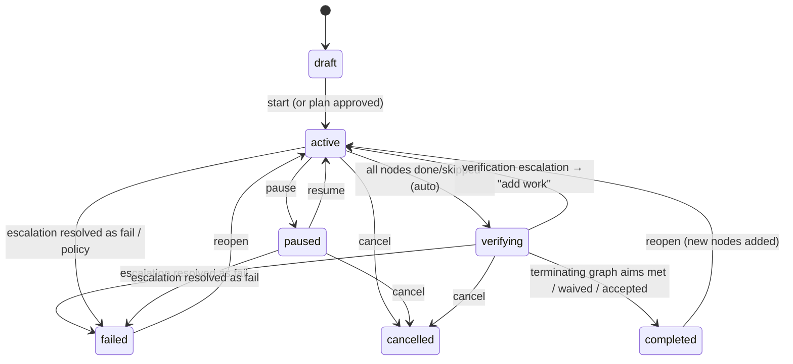
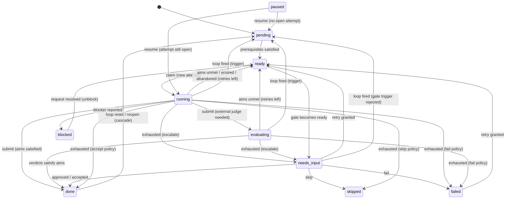

# Concepts & semantics

This is the **normative** definition of the Agent Graphs domain. The data model, API, UI, and
agent protocol must agree with it. When they disagree, this document wins and the others get fixed.

- [1. Glossary](#1-glossary)
- [2. Graph](#2-graph)
- [3. Nodes](#3-nodes)
- [4. Attempts](#4-attempts)
- [5. Edges](#5-edges)
- [6. Aims](#6-aims)
- [7. Iteration: retries and loops (failure-cycles)](#7-iteration-retries-and-loops-failure-cycles)
- [8. Orchestrators](#8-orchestrators)
- [9. Notes and execution annotations](#9-notes-and-execution-annotations)
- [10. Sessions, identity, and leases](#10-sessions-identity-and-leases)
- [11. Human-in-the-loop: requests and directives](#11-human-in-the-loop-requests-and-directives)
- [12. Context resilience](#12-context-resilience)
- [13. Events and audit](#13-events-and-audit)
- [14. Policies](#14-policies)
- [15. Invariants](#15-invariants)
- [16. Self-evolution (optional)](#16-self-evolution-optional)

---

## 1. Glossary

| Concept | One-liner |
|---|---|
| **Graph** | A plan for a body of work (for example "build the MVP") plus the live record of its execution. |
| **Node** | A unit of work (`task`), a decision checkpoint (`gate`), or a zero-work marker (`milestone`). |
| **Edge** | A dependency between nodes: `requires` (blocking) or `informs` (context only). Edges can carry procedural knowledge: `condition`, `guidance`, `pitfalls`. |
| **Aim** | A terminating condition. Either **qualitative** (judged) or **quantitative** (measured against a target). |
| **Attempt** | One execution of a node by one agent. Nodes iterate by making more attempts. |
| **Loop** | A bounded **failure-cycle**. When a trigger node fails its aims, a body of nodes is re-run, with feedback. |
| **Orchestrator** | A supervisory agent role that spans the whole graph, outside the task DAG. |
| **Note** | An annotated record attached to a node, orchestrator, or graph: proof, deliverable, finding, decision, handoff… |
| **Execution annotation** | Who and what produced something: agent, role, model, thinking level, provider, delivery mechanism, usage. |
| **Session** | A registered agent or human process. Sessions hold leases on attempts and orchestrator roles. |
| **Request** | An item that needs a human or orchestrator decision. Requests make up the **Inbox**. |
| **Directive** | Guidance or a change sent *to* agents. It is delivered, then acknowledged. |
| **Event** | An append-only, hash-chained audit record of every change. |
| **Briefing / Sitrep** | A token-budgeted context packet for one node (briefing) or for the whole graph (sitrep). |
| **Lesson** | Itemized procedural knowledge learned from experience (usually a failed→passed contrast), retrieved into briefings. *(Optional; see §16.)* |
| **Proposal** | A gated, audited edit to a graph or template, made by the `evolver` role. *(Optional; see §16.)* |

The server is a **coordination ledger and state machine**. It never runs agents itself. Agents pull
work, do it wherever they run (Claude Code, an SDK agent, another provider's CLI, or a human),
and report back. An optional built-in runner is a later milestone (see [PLAN](PLAN.md#7-roadmap)).

---

## 2. Graph

A graph holds:
- `title`, an optional `slug`, `description`, `tags`, and an optional `repository` (`url`,
  `branch`, `path`)
- shared `context` (markdown) and `constraints` (hard rules) that appear in every briefing
- **overall aims**
- `policy` (section 14)
- `defaults` for node fields
- the optional top-level `evolution` settings (section 16)
- its orchestrators, nodes, edges, and loops

**Precedence for node settings**: a value on the node wins over `defaults`, which wins over
`policy`. This applies to `maxAttempts`, `onExhausted`, and `leaseTtl`. A node's `executor`
is shallow-merged over `defaults.executor`, so fields set on the node override, and unset
fields inherit.

### 2.1 Status

| Status | Meaning |
|---|---|
| `draft` | An editable plan. Nothing can be claimed. |
| `active` | Executing. Ready nodes can be claimed. |
| `paused` | No new claims. Running attempts receive a `pause` directive but may still submit. |
| `verifying` | Every node is `done` or `skipped`. The graph's own aims are being evaluated. |
| `completed` | All terminating graph aims are met, waived, or accepted. |
| `failed` | Declared failed by a human or orchestrator decision, or by policy. |
| `cancelled` | Stopped by a human. Open attempts are cancelled. |

Archiving is orthogonal (`archivedAt`). Any graph that is not `active` or `verifying` can be
archived, and archived graphs are hidden from default lists.



**Stalled** is a derived condition, not a status. It is stored as `graphs.stalled` and maintained
by the stall job. An `active` graph is stalled when:
- no node is `ready`, `running`, or `evaluating`, and
- at least one node is `blocked`, terminally `failed`, or in `needs_input` because of an
  escalation.

A graph that is only waiting on routine gate approvals is shown as *waiting on approval*, not
stalled. Stalled graphs get a badge. The server opens a `stall` escalation when a terminally
`failed` node blocks progress.

**Verification.** In `verifying`, every terminating graph aim is evaluated:
- Quantitative aims use graph-level reports or derived metrics.
- Qualitative aims are judged by an orchestrator or a human.

If all are met or waived, the graph completes. If any is unmet, the server opens a
`verification` escalation. Its options are **add work** (the graph returns to `active` so nodes
can be added), **waive** an aim (with justification), **accept** (completed, with
`acceptedWithDeviation`), or **fail**.

### 2.2 Plan approval

When `policy.requirePlanApproval` is true, a `start` from an agent creates an `approval` request
(the plan review) instead of starting the graph. A human can inspect and edit the graph in the UI,
then approve. Approval starts the graph. The graph stays `draft` with `pendingApproval = true`
until then.

---

## 3. Nodes

### 3.1 Kinds

| Kind | Does work? | Requirements | Completes when |
|---|---|---|---|
| `task` | Yes, by an agent | `aim`, `prompt`, and ≥1 **terminating** aim | Its terminating aims are satisfied (per `aimMode`). |
| `gate` | No, it is a decision | `aim` and `gate.approver` (`human` or `orchestrator`) | The approver approves. Rejection fails it, and fires its loop if it triggers one. |
| `milestone` | No | none | All prerequisites are done or skipped, and its own aims, if any, are met. It completes automatically. If its aims are unmet, it goes to `needs_input` with an escalation. |
| `group` *(M5)* | No, it is a container | ≥1 child | All children are done or skipped (and its own aims, if any, are met). |

### 3.2 Fields

| Field | Purpose |
|---|---|
| `key` | Stable, human-readable id, unique within the graph (`^[a-z0-9][a-z0-9-]{0,63}$`). Agents address nodes by key. |
| `title` | Short name. |
| `aim` | One-sentence **outcome** statement: what will be true when this node is done. |
| `purpose` | **Why** the node exists: how it serves the graph's aims. |
| `prompt` | **Instructions** for the executing agent (markdown). Required for tasks. |
| `context` | Extra node-specific background (markdown). |
| `deliverables` | Expected outputs (files, PRs, deployments, docs), as strings or `{name, description, required}`. |
| `checklist` | Optional procedural steps (`{key, title, required}`). Required items must be ticked, with evidence, before submit. |
| `aims` | Acceptance criteria (section 6). |
| `aimMode` | `all` (default) or `any`: how terminating aims combine. |
| `needs` / `informedBy` | Authoring sugar for `requires` and `informs` edges. |
| `priority` | `p0` (highest) to `p3`. Default `p2`. |
| `tags` | Free-form labels. Used for orchestrator scope and filters. |
| `executor` | **Recommendations** for who should run it: `role`, `model`, `thinking`, `provider`, `mechanism`, `instructions`. Also `requires`, a list of **skills** (for example `repo-write`, `staging-access`) that a claiming session must declare. It is a **hard** filter for `next` and claim. Session *skills* are distinct from orchestrator *capabilities* (§8). |
| `maxAttempts` | Self-iteration bound per activation (section 7.1). Default comes from policy (3). |
| `onExhausted` | `escalate` (default), `fail`, `skip`, or `accept`. |
| `leaseTtl`, `timeout` | Lease length override; soft maximum duration per attempt (exceeding it opens an escalation). |
| `metadata` | Free-form JSON for integrations. |

Runtime fields include `status`, `statusReason`, `activation` (incremented every time a loop
resets the node), `currentAttemptId`, `acceptedWithDeviation`, and timestamps.

### 3.3 Status

| Status | Meaning | Claimable | Terminal |
|---|---|---|---|
| `pending` | Waiting on prerequisites. | no | no |
| `ready` | Prerequisites satisfied; waiting for an agent. | **yes** (tasks) | no |
| `running` | An attempt holds a lease. | no | no |
| `evaluating` | Work submitted. Waiting on a judge (agent, orchestrator, or human) for some terminating aim. | no | no |
| `needs_input` | A decision is needed: a gate awaiting approval, or an escalation after exhaustion. | no | no |
| `blocked` | An agent reported an external blocker. A blocking request is open. | no | no |
| `paused` | Paused by a human or orchestrator. | no | no |
| `done` | Terminating aims satisfied (or waived); a gate approved; or accepted with `acceptedWithDeviation` by policy or escalation. | — | yes (success) |
| `skipped` | Intentionally not executed, with a reason. Dependents may proceed. | — | yes (success) |
| `failed` | Exhausted or declared failed. | — | yes (failure) |
| `cancelled` | Its graph was cancelled. | — | yes (failure) |



Pausing, skipping, and failing by decision are allowed from many statuses, so they are listed in
the actions table (§3.4) rather than drawn.

Notes:
- **Readiness.** A `pending` node becomes `ready` when the graph is `active`, the node is not
  paused, and every `requires` predecessor is `done`, or `skipped` when
  `policy.skippedSatisfiesDeps` is true (the default). Readiness is recomputed for successors
  after every status change.
- **Gates.** When a gate becomes ready it moves straight to `needs_input` and opens an
  `approval` request for its approver.
- **Gate decisions** are recorded as evaluations of the gate's implicit `approval` aim (with no
  attempt). A rejection comment and its evidence become the loop feedback when the gate triggers
  a loop.
- **Milestones.** When a milestone becomes ready, its aims are evaluated immediately (they are
  usually derived metrics, or there are none). It moves to `done`, or to `needs_input` with an
  escalation (options: waive, add work, fail) if an aim is unmet.
- **Pausing.**
  - New claims stop at once, and the node shows `paused`.
  - An open attempt receives a `pause` directive. It should checkpoint, then release; that
    release is not counted. Its lease may still expire, and an expiry during a pause is not
    counted either.
  - A submission that arrives while paused is processed normally. If it passes, the node becomes
    `done` and the pause ends. If it fails, the retry or loop decision is deferred until resume.
  - On resume, the node returns to `running` (or `evaluating`) if an attempt is still open.
    Otherwise it returns to `pending` and readiness is recomputed. A node never has two open
    attempts (invariant 2).
- **Skipping** requires a reason and is recorded as an event and a `decision` note. If an attempt
  is open, it becomes `cancelled`.
- **Reopening a done node** (admin action) **cascades**. The node and every descendant reachable
  through `requires` edges that has started get `activation += 1` and go to `pending`. Their open
  attempts become `superseded` with reason `upstream reopened`, and enclosing loops that were
  `satisfied` become `active`. This is the only way to change prerequisites of a started node:
  reopen it, add the edge, and readiness is recomputed.
- **Manual completion** (admin action) records work done outside the system, for example by a
  human or before the graph was tracked. It creates an attempt executed by the caller, with
  evaluations and evidence. Terminating aims without a verdict are recorded as `waived`, with the
  summary as justification. The node becomes `done`, and the audit view marks it as manual.

### 3.4 Actions by humans and orchestrators

| Action | Allowed from | Effect |
|---|---|---|
| `pause` | pending, ready, running, evaluating, needs_input, blocked | → `paused` (see Pausing) |
| `resume` | paused | → running / evaluating / pending (see Pausing) |
| `skip` (reason) | pending, ready, running, evaluating, needs_input, blocked, failed | → `skipped`; open attempt → `cancelled` |
| `retry` (+N attempts) | failed, needs_input (exhaustion) | `granted_attempts += N` → `ready` |
| `fail` (reason) | ready, running, evaluating, needs_input, blocked | → `failed`; open attempt → `cancelled` |
| `reopen` (admin) | done, skipped, failed | cascade reset (see above) |
| `complete-manually` (admin) | pending, ready, needs_input, blocked, failed | → `done` (manual) |

`granted_attempts` resets with each new activation. `granted_iterations` on a loop lasts for the
loop's lifetime, unless an enclosing loop resets it.

---

## 4. Attempts

An attempt is one agent's execution of one node. It is created by **claim**. It records
`number` (per node, monotonic), `activation` (the node's activation when claimed), the
execution annotation of the claimer, optional `dispatchedBy` (the orchestrator that claimed on
someone's behalf), the lease (`leaseExpiresAt`, `lastHeartbeatAt`), progress (`progress` 0–100,
`currentStep`, `checkpoint` JSON), the `feedbackIn` snapshot (exactly what feedback the agent
was given at start), `summary` (required on submit), `outcomeReason`, `usage` (tokens, cost),
and timestamps.

| Attempt status | Meaning | Counts toward `maxAttempts`? |
|---|---|---|
| `running` | Lease held; work in progress. | — |
| `submitted` | Work submitted; awaiting external evaluation. | — |
| `passed` | Terminating aims satisfied. | — |
| `failed` | Evaluated; terminating aims unmet. | **yes**, unless the node is a loop trigger (the loop handles aim failures, §7.1) |
| `errored` | The agent reported an execution error. | **yes** |
| `abandoned` | The lease expired (counted) or the agent released voluntarily (not counted). | expired: **yes** (except during a pause); released: no |
| `blocked` | The agent stopped on an external blocker. | no |
| `superseded` | Its result was invalidated because the node was reset (by a loop or a reopen cascade). | no |
| `cancelled` | The graph was cancelled, or the node was skipped or failed by decision, while the attempt was open. | no |

At most one attempt per node is `running` or `submitted` at any time.

**Leases apply only to `running` attempts.** A lease ends at submit, fail, block, or release. A
`submitted` attempt holds no lease, so a worker can stop while a judge decides.
`leaseExpiresAt` is null outside `running`.

**Usage** reported in heartbeats and submissions is **cumulative for the attempt**: the latest
report replaces the previous one. Graph and node cost are the sum of their attempts' latest usage.

**`fail` with `retryable: false`** marks the task as impossible as specified. The node exhausts
immediately and its `onExhausted` applies, with no retries.

---

## 5. Edges

- **`requires`** (from `needs`): the target cannot start until the source is done (or skipped,
  per policy). `requires` edges must form a **DAG**. The source's deliverables, summary, and
  handoff notes appear under *Inputs* in the target's briefing. *Inputs* covers direct
  prerequisites only (1 hop). *Downstream consumers* reaches up to 2 hops.
- **`informs`** (from `informedBy`): context only, never blocking. When the source has results,
  they appear under *Related context* in the target's briefing. A self-edge is invalid, and an
  `informs` edge that closes a cycle with `requires` edges produces a warning.
- An edge can carry a `label` that describes what flows along it (for example "API contract").
- **Procedural knowledge on edges**, following Procedural Graphs ([self-evolution
  §6](self-evolution.md#6-procedural-knowledge-on-edges)). An edge may carry `condition` (when the
  transition applies), `guidance` (how to execute the next step), and `pitfalls` (errors and dead
  ends to avoid), plus a semantic `relation`: `leads_to`, `triggers`, `provides_input_for`, or
  `converges_to`. When `relation` is omitted it defaults from the edge kind. Briefings render
  incoming edges' attributes under *Inputs* and outgoing edges' under *Downstream consumers*.
  The `relation` never changes scheduling; only `kind` does.
- Prerequisites cannot be added to a node that has already started (it is `running` or later).
  Reopen it first (§3.3, which cascades to its descendants), then add the edge.

---

## 6. Aims

Aims are first-class terminating conditions. They exist on **nodes**, on the **graph**, and
optionally on **orchestrators** (where they are informational).

### 6.1 Shape

```ts
type Aim = {
  key: string;                    // unique within its owner
  title: string;                  // the statement, e.g. "API test suite passes"
  description?: string;
  kind: 'qualitative' | 'quantitative';
  terminating: boolean;           // default true: gates completion
  guard?: boolean;                // default false: watched continuously (6.6)
  weight?: number;                // for UI and scoring only
  // quantitative
  metric?: string;                // e.g. "test_pass_rate"
  comparator?: 'gte' | 'gt' | 'lte' | 'lt' | 'eq' | 'neq' | 'between';
  target?: number;
  targetMax?: number;             // for 'between'
  unit?: string;                  // "ratio", "%", "ms", "count", "usd", …
  source?: 'reported' | 'derived';     // default 'reported'
  aggregation?: 'latest' | 'min' | 'max' | 'avg' | 'sum';  // default 'latest'
  // qualitative
  criteria?: string[];            // rubric bullets for the judge
  evaluator?: 'self' | 'agent' | 'orchestrator' | 'human';  // default 'self'
  evaluatorKey?: string;          // a specific orchestrator, when evaluator = 'orchestrator'
};
```

Aim **status** within the owner's current activation is `pending` (not yet evaluated), `met`,
`unmet`, `partial`, or `waived`. `partial` counts as unmet for termination but is shown
distinctly.

### 6.2 The terminating rule

> Every `task` node must have **at least one terminating aim**, qualitative or quantitative or
> both. That aim is what makes "done" mean something.

Gates have an implicit terminating aim (the approval). Milestones and groups may have none.
Validation rejects tasks without a terminating aim.

Non-terminating aims (`terminating: false`) are tracked and charted but never block completion.
Use them for useful signals such as bundle size or performance.

### 6.3 Quantitative evaluation

- Agents **report metrics** during an attempt (`metrics_report`, or in notes and submissions).
  The value used is the attempt's metric series reduced by `aggregation` (latest by default).
- The server **computes the verdict** automatically:
  `gte: v ≥ t`, `gt: v > t`, `lte: v ≤ t`, `lt: v < t`, `eq: |v − t| ≤ 1e-9`,
  `neq: |v − t| > 1e-9`, `between: t ≤ v ≤ targetMax`.
- Submission completeness (see §6.5 for `aimMode`) only concerns **terminating, reported**
  aims. Derived and non-terminating aims are never required at submit. A submission missing a
  required value is rejected (`422 AIM_EVIDENCE_MISSING`) with a hint that names the metric. The
  agent must measure it, or call `fail` if it cannot.
- **Derived metrics** are computed by the server (`source: derived`):

| Metric | Scope | Meaning |
|---|---|---|
| `nodes_done_ratio` | graph | (done + skipped) / total nodes |
| `cost_usd` | graph, node | Sum of reported attempt usage cost |
| `tokens_total` | graph, node | Sum of reported tokens |
| `elapsed_hours` | graph | Wall time since start |
| `failed_attempts` | graph, node | Count of counted failures |
| `open_findings_high` | graph | Findings with severity ≥ high that are neither retracted nor resolved (§9.1) |
| `children_done_ratio` | group | (done + skipped) children / children |

### 6.4 Qualitative evaluation

The `evaluator` decides who judges:

| Evaluator | Who submits the verdict | When |
|---|---|---|
| `self` | The working agent, inside its submission (verdict, rationale, evidence) | At submit. Missing verdicts are rejected (`422`). |
| `agent` | Any **independent** agent session, such as a judge subagent | After submit. The node is `evaluating` and the item is queued for reviewers. |
| `orchestrator` | An attached orchestrator with the `evaluate` capability whose scope covers the node (or the one named by `evaluatorKey`) | After submit; queued for that orchestrator. |
| `human` | A human in the UI | After submit. Opens an `approval` request in the Inbox. |

Pending `agent`-judged items are discoverable through `GET /evaluations/pending` and the
`evaluations_pending` MCP tool, which exclude attempts the caller executed. Orchestrators also see
them in their duty queues.

**Graph aims** cannot use `self` or `agent` evaluators; only `orchestrator` or `human` judge
them. The plain-string shorthand on a graph aim therefore expands to `evaluator: human`.

An evaluation records `verdict` (`met | unmet | partial`), `rationale`, `evidence[]`, optional
`score`, and the evaluator's execution annotation.

**Independence.** When `policy.evaluation.independent` is true (the default), verdicts from
`agent` or `orchestrator` evaluators must come from a session other than the attempt's executor
**session**. Sessions created for subagents dispatched by an orchestrator are distinct child
sessions (§10), so a judge subagent is independent of a worker subagent. Otherwise the server
returns `403 POLICY_DENIED`.

### 6.5 Combining aims and finalizing

**Submit completeness.**
- `aimMode: all`: every terminating `self` aim needs a verdict, and every terminating reported
  quantitative aim needs a value.
- `aimMode: any`: at least one terminating aim must be decidable at submit, or have an external
  evaluator.

**Short-circuits.**
- `all`: the first unmet terminating verdict or value fails the attempt immediately, without
  waiting for external judges.
- `any`: the first met one passes it.

Either way, evaluations still pending are cancelled.

Otherwise, once every terminating aim of the current attempt has a verdict:

```
satisfied = aimMode == 'all'
  ? every terminating aim ∈ {met, waived}
  : some  terminating aim ∈ {met, waived}
```

`satisfied` → attempt `passed`, node `done`. Otherwise the attempt is `failed` and the failure
policy of section 7 applies.

**Edits during an attempt.** If a human edits a node's aims while an attempt is open, the
attempt is judged against the aim definitions current at **submit** time. The agent learns of the
edit through a `change` directive, and the UI warns the editor.

**Waiving.** A human (or an orchestrator with `resolve`) can waive an aim with a justification.
Waivers are events, and they are shown prominently in the audit view.

### 6.6 Graph aims and guard aims

- Graph aims use the same shape. Quantitative graph aims take values from graph-level metric
  reports or derived metrics. Qualitative graph aims are judged by an orchestrator or a human.
- Graph aims are **displayed live**, but they **terminate** only during `verifying`. If none
  are defined, the server adds the default derived aim `nodes_done_ratio ≥ 1` ("all nodes
  complete").
- A **guard aim** (`guard: true`) is evaluated continuously. When it becomes unmet (for example
  `cost_usd ≤ 40` is exceeded), the server **pauses the graph** and opens an escalation. Guards
  are how budgets and time limits are enforced.

---

## 7. Iteration: retries and loops (failure-cycles)

Iteration is always **bounded**. Two mechanisms cover it.

### 7.1 Self-iteration (`maxAttempts`)

A node may make up to `maxAttempts + grantedAttempts` **counted** attempts per activation (see
the table in section 4). After an attempt ends, apply the first matching rule:

1. **Loop trigger, aims unmet.** The node triggers a loop, and the outcome is `failed` (or, for
   a gate, rejected). Aim failures of a trigger never consume self-retries.
   - If `iteration < maxIterations + grantedIterations`, **the loop fires** (7.2).
   - Otherwise the **loop is exhausted**: its status becomes `exhausted`, `loop.exhausted` is
     emitted, and the **loop's** `onExhausted` applies to the trigger (7.4). There is no
     self-retry.
2. **Retries left.** The outcome counts (`failed` on a non-trigger, `errored`, or a counted
   `abandoned`), and counted attempts are below the bound. The node returns to `ready`. The next
   attempt's briefing carries **feedback**: unmet aims with rationales and values for `failed`,
   the error for `errored`, and the last checkpoint and handoff for `abandoned`. Triggers also
   self-retry on `errored` and `abandoned` this way.
3. **Exhausted.** A counted outcome with no retries left, or `fail` with `retryable: false`. The
   node is **exhausted** and the **node's** `onExhausted` applies (7.4).
4. **Uncounted outcomes** (`blocked`, released `abandoned`, `superseded`, `cancelled`) never
   trigger retries or exhaustion on their own.

### 7.2 Loops

A loop is a bounded back-edge for cycles that span several nodes, the classic
*implement → test → (fail) → implement* cycle:

```yaml
loops:
  - key: api-fix-cycle
    from: api-tests        # trigger: when this node's terminating aims fail…
    to: implement-api      # …re-enter here
    maxIterations: 4       # total passes through the body, including the first
    onExhausted: escalate
```

- **Body**: every node on a `requires` path from `to` to `from`, inclusive. It is computed at
  validation time and stored.
- **Iteration counter**: starts at 1. It is shown as `↺ 2/4`.
- **Status**: `idle` (not entered yet), `active` (body in progress), `satisfied` (trigger
  passed), `exhausted`.

**Structure rules** (validation errors), which keep loops interpretable and resets well-defined:

1. `from ≠ to`. Use `maxAttempts` for self-retry.
2. `from` is reachable from `to` through `requires` edges.
3. **Laminar**: any two loop bodies are either disjoint or nested. They never partially overlap.
4. A node triggers **at most one** loop.
5. **Single exit**: every `requires` edge from a body node to a node outside the body must start
   at the trigger (`from`). An `informs` edge leaving the body produces a warning.
6. `1 ≤ maxIterations ≤ 50`.

External inputs into any body node are allowed. They are already satisfied, or are satisfied
concurrently.

**Firing.** When the trigger fails (its attempt is `failed`, or for a gate, the approval is
rejected) and `iteration < maxIterations + grantedIterations`, all of the following happen in
one transaction:

1. `iteration += 1` and the loop is `active`.
2. Every `done` body node, and the trigger itself, gets `activation += 1`. Its last passed
   attempt, if any, becomes `superseded`, and its status becomes `pending`. `skipped` body nodes stay
   skipped, because a skip is a deliberate decision with a reason. Readiness is then recomputed,
   so `to` usually becomes `ready`.
3. Every loop nested inside the body resets to `iteration = 1` and `idle`, and its
   `grantedIterations` returns to 0.
4. **Loop feedback** is recorded. For task triggers, it is the trigger's unmet aims with values
   and rationales, its summary, and its `finding` notes. For gate triggers, it is the rejection
   comment and its evidence. This feedback leads the briefing for `to` and appears in the
   briefings of every other body node in the new iteration.
5. Events `loop.iterated` and `node.status_changed` (one per reset node) are emitted.

When the trigger fails, every non-trigger body node is `done` or `skipped`, because all of them
are ancestors of the trigger. Downstream nodes outside the body have not started, by the
single-exit rule. So a reset never invalidates in-flight work.

**Extending an exhausted loop** (the `extend` option of its escalation) adds
`grantedIterations` and **fires the loop immediately**, using the latest feedback.

**Nesting.** An inner loop gets a fresh iteration budget on each outer iteration, like nested
`for` loops. The UI shows both counters.

### 7.3 Example

```
requirements → design → implement-api → api-tests → e2e → release-review → ship
                          ▲                │                     │
                          └── api-fix ─────┘ (max 4)             │
               ▲                                                 │
               └──────────── release-cycle (max 2) ──────────────┘
```

When `api-tests` fails on iteration 2/4, `implement-api` and `api-tests` reset and the loop goes
to 3/4. If `release-review` (a human gate) is rejected, everything from `design` onward resets.
The inner loop goes back to 1/4 and the outer loop goes to 2/2.

### 7.4 Exhaustion policies

| `onExhausted` | Node (self-iteration) | Loop |
|---|---|---|
| `escalate` *(default)* | Node → `needs_input` with an escalation request. Options: **retry** (+N attempts), **accept** as-is (`done` with `acceptedWithDeviation`), **skip**, **fail**, **edit & retry**. | Trigger → `needs_input` with an escalation request. Options: **extend** (+N iterations, fires immediately), **accept**, **fail**, **edit & retry**. |
| `fail` | Node → `failed`. | Trigger → `failed`. |
| `skip` | Node → `skipped` (reason: exhausted). | Not allowed for loops (a validation error). |
| `accept` | Node → `done` with `acceptedWithDeviation`. | Trigger → `done` with `acceptedWithDeviation`. This applies to gate triggers too, and is flagged in the audit view. |

A terminally `failed` node with dependents makes the graph stalled (2.1). An escalation then
lets a human or an orchestrator retry, skip, or fail the graph.

---

## 8. Orchestrators

Orchestrators are **agent roles that run across the whole graph, outside the task DAG**. One
example is a lead agent that dispatches subagents. Others are a reviewer that judges quality,
an integrator that merges branches, and a monitor that audits proof or watches the budget.

| Field | Purpose |
|---|---|
| `key`, `name` | Identity within the graph. |
| `role` | `lead`, `reviewer`, `integrator`, `monitor`, `evolver` (optional self-evolution, §16), or `custom`. |
| `aim`, `purpose`, `prompt` | As for nodes: what it achieves, why, and how. |
| `scope` | `all`, `{ nodes: [...] }`, or `{ tags: [...] }`: which nodes it acts on. |
| `capabilities` | `dispatch` (claim on behalf of subagents), `evaluate` (judge aims), `mutate` (add or modify nodes, per policy), `resolve` (resolve requests and waive aims), `approve` (approve gates assigned to orchestrators), `evolve` (record lessons and submit evolution proposals, §16). |
| `triggers` | The event types it reacts to (for example `attempt.submitted`, `request.created`, `loop.exhausted`; names from the [event catalog](data-model.md#event-catalog)). These route notifications and feed its duty queue. |
| `aims` | Optional, informational. For example "every done node has a proof note". |
| `executor` | Recommended model, thinking, and mechanism. |

**Lifecycle.** An orchestrator is `idle` until a session **attaches** (`active`). Attaching takes
a lease, renewed by heartbeat. When the lease lapses, the orchestrator returns to `idle` and
another session can take the role over: the handoff. Humans can set it to `paused` or `stopped`.

**Duty queue.** For each orchestrator, the server computes the items it should act on, given its
capabilities and scope:
ready nodes to dispatch (`dispatch`), submitted attempts awaiting its verdict (`evaluate`), open
requests assigned to orchestrators or to it (`resolve` and `approve`), stale leases, guard
violations, and loop exhaustions (`resolve`).

**Acting on behalf.** An orchestrator with `dispatch` can claim a node *for* a subagent:
- The claim creates a **child session** for the worker's annotation, whose `parentSessionId`
  is the orchestrator's session. The attempt is held by that child session.
- The attempt records `dispatchedBy`, and the subagent reports using the attempt id.
- A session heartbeat (for example from Claude Code hooks, keyed by the shared Claude
  `session_id`) renews the leases of the session **and all its descendants**.
- Independence checks compare sessions, so a judge subagent in another child session counts as
  independent of the worker.
- Notes the orchestrator writes about someone else's work carry `relayedBy`, so the audit trail
  shows who did the work and who reported it.

Orchestrator actions appear in the event log with the orchestrator as actor. In the UI they
appear in the *orchestration lane* above the DAG.

---

## 9. Notes and execution annotations

### 9.1 Notes

Notes are append-only records written by agents, orchestrators, humans, or the system. A note
attaches to a **node** (optionally a specific attempt), an **orchestrator**, or the **graph**.

| Type | Use it for | Expectations |
|---|---|---|
| `proof` | **Proof of completion**: test output, verification commands, screenshots, CI links | Should include ≥1 evidence item. The audit view flags done nodes without one. |
| `deliverable` | **Real outcomes**: files, commits, PRs, deployments, artifacts, docs | Should include evidence (commit, PR, file, url). |
| `finding` | Discoveries, bugs, risks, insights | `severity`: `info`, `low`, `medium`, `high`, or `critical`. |
| `decision` | Decisions and their rationale (lightweight ADR) | Title states the decision; body gives alternatives and rationale. |
| `handoff` | A **checkpoint for whoever continues**: state, what's left, gotchas | Write one before stopping, before compaction, and at milestones in long tasks. |
| `progress` | Status updates during long work | Brief. |
| `question` | A question for a human or orchestrator | Creates a `question` request (section 11). |
| `blocker` | An external blocker | Created by the block action; creates a `blocker` request. |
| `comment` | Discussion, including human comments and replies | Threaded via `replyTo`. |

Fields: `type`, `title`, `body` (markdown), `severity?`, `evidence[]`, `metrics?` (also
recorded as metric reports), `author` (the execution annotation), `relayedBy?`, `usage?`,
`replyTo?`, `pinned`, `retractedAt?` and `retractedReason?`, and for findings, `resolvedAt?` and
`resolvedBy?`.

**Resolving a finding** (`POST /notes/{id}/resolve`, with a comment) posts a reply note and
stamps `resolvedAt`. A finding is *open* until it is resolved or retracted, which is what
`open_findings_high` counts.

**Evidence item**: `{ kind, label?, value, meta? }`. `kind` is one of `url`, `file` (path plus
optional `repo`, `ref`, and line range), `commit` (sha plus repo and branch), `pr`, `command`
(the command line, plus `exitCode` and an `output` excerpt in `meta`), `metric`, `image`,
`text`, or `artifact`.

Notes are **never edited or deleted**. Correct a note by posting a new note with `replyTo`, or
**retract** it with a reason. The original stays visible in the audit trail.

### 9.2 Execution annotation

Every note, evaluation, attempt, metric report, and event carries an annotation of what
produced it:

```ts
type ExecutionAnnotation = {
  kind: 'agent' | 'human' | 'system';
  agent?: string;          // display name, e.g. "backend-dev subagent"
  role?: string;           // e.g. "worker", "lead", "reviewer"
  model?: string;          // e.g. "claude-opus-5-5"
  thinking?: string;       // 'off' | 'low' | 'medium' | 'high' | 'xhigh' | 'max' | provider-specific
  thinkingBudget?: number; // tokens, when the provider uses budgets
  provider?: string;       // e.g. 'anthropic' | 'openai' | 'google' | 'aws-bedrock' | 'gcp-vertex' | 'azure' | 'local' | 'human'
  mechanism?: string;      // delivery mechanism, e.g. 'claude-code' | 'claude-code-web' | 'claude-agent-sdk' | 'claude-api'
                           // | 'codex' | 'gemini-cli' | 'cursor' | 'github-action' | 'mcp' | 'cli' | 'api' | 'ui'
  sessionId?: string;      // Agent Graphs session id
  clientSessionId?: string;// the agent runtime's own session id (e.g. a Claude Code session_id)
  parentSessionId?: string;// the session that spawned this one (e.g. a lead orchestrator)
  version?: string;        // client or runtime version
};
type Usage = { inputTokens?: number; outputTokens?: number; cacheReadTokens?: number;
               cacheWriteTokens?: number; costUsd?: number; durationMs?: number };
```

The vocabularies are open (any string is accepted), but the listed values get first-class icons,
colors, and grouping in the UI. `GET /api/v1/vocab` publishes them. Defaults flow down: a note
written on an attempt inherits the attempt's annotation unless it overrides fields, so agents
declare their identity once, at claim time. A node's `executor` hints are compared with the
actual annotation, and the UI flags mismatches (for example "recommended Opus · high, ran on
Sonnet · medium").

---

## 10. Sessions, identity, and leases

- A **session** is a registered agent or human process: name, kind, role, model, thinking,
  provider, mechanism, `skills`, `clientSessionId`, and `parentSessionId`. Registering is
  optional. A claim with an inline annotation creates or looks up the session, keyed by
  `clientSessionId` when one is given. A claim with `dispatchedBy` always creates a child session
  of the orchestrator's session (§8).
- **Leases.** Claims (for `running` attempts only) and orchestrator attachments take leases.
  The default is 30 min, set by `policy.leaseTtl` or the node's `leaseTtl`. Leases are renewed by
  **attempt heartbeats** or by **session heartbeats**, which renew every lease held by the
  session and its descendant sessions. Claude Code hooks send session heartbeats on tool use,
  keyed by the Claude `session_id`.
- **Sweeper.** Every 30 s the server expires leases. Expired attempts become `abandoned`, which
  counts unless the node is paused; the node then returns to `ready` or exhausts. Sessions with
  no heartbeat for longer than their longest lease become `lost`.
- **Trust model**: *honest but fallible agents*. API tokens keep outsiders out and assign roles
  (`admin`, `agent`, `viewer`). Within the agent role, the **attempt id is a capability**:
  whoever holds it can heartbeat, note, report, and submit for that attempt. Annotations are
  self-declared and shape-validated. The goal is to prevent mistakes (double claims, cross-talk,
  judging your own work) and to keep an honest record. It is not a defense against malicious
  agents. Per-session secrets can tighten this later.

---

## 11. Human-in-the-loop: requests and directives

The feedback loop between humans, orchestrators, and agents is explicit and auditable:

```
 agents ──(questions, blockers, escalations, approvals)──▶ Requests (Inbox) ──▶ humans / orchestrators
    ▲                                                                              │
    └──(guidance, changes, answers, pause/cancel)── Directives ◀── resolutions, config edits
```

### 11.1 Requests

A request has a `kind`, a `subject`, an `assignee` (`human`, `orchestrator` with an optional
key, or `any`), `blocking`, and `options`. Its status is `open`, `resolved`, `dismissed`, or
`expired`. Resolving it (`POST /requests/{id}/resolve { choice, comment?, data? }`) records the
choice, comment, and annotation of the resolver, then applies the effect atomically.

**Option catalog.** This is the resolution contract: option ids, `data` schema, and effect.

| Kind · subject | Option id → `data` → effect |
|---|---|
| `approval` · `gate` | `approve` → `{}` → gate `done` · `reject` → `{}` (comment required) → gate `failed`, and its loop fires if it is a trigger (§7.1) |
| `approval` · `aim` (human-judged) | `approve` → `{ verdict?: 'met' \| 'partial' }` → evaluation recorded · `reject` → `{}` (comment required) → verdict `unmet` |
| `approval` · `plan` | `approve` → graph starts · `reject` → graph stays `draft`, and the comment becomes a `guidance` directive on the graph |
| `approval` · `proposal` (M5) | `approve` → proposal committed · `reject` → proposal `rejected`, into the rejection memory |
| `question` | `answer` → `{ text, choice? }` → an `answer` directive targeting the asking attempt (or its node, if the attempt has ended) |
| `escalation` · `exhaustion` | `retry` → `{ extraAttempts ≥ 1 }` · `accept` → `{ justification }` · `skip` → `{ reason }` · `fail` → `{ reason }` · `edit_retry` → `{ patch, extraAttempts? }` (applies a node patch, then retries) |
| `escalation` · `loop` | `extend` → `{ extraIterations ≥ 1 }` (fires the loop immediately) · `accept` · `fail` · `edit_retry` → `{ patch, extraIterations? }` |
| `escalation` · `guard` | `raise_target` → `{ target }` (human only, because aims are protected; the graph resumes) · `waive` → `{ justification }` (the graph resumes) · `fail`. There is no plain "resume", because an unchanged guard would re-trip at once. |
| `escalation` · `stall` | `retry` / `skip` / `fail` → `{ nodeKey, … }` on a blocking node · `fail_graph` |
| `escalation` · `verification` | `add_work` → graph `active` · `waive` → `{ aimKey, justification }` · `accept` → `{ justification }` (completed, `acceptedWithDeviation`) · `fail` |
| `escalation` · `timeout` | `extend` → `{ duration }` · `fail_attempt` (counted `errored`) · `ignore` |
| `escalation` · `milestone` | `waive` → `{ aimKey, justification }` · `add_work` · `fail` |
| `blocker` | `unblock` → `{ info }` (an `answer` directive on the node; node → `ready`) · `skip` → `{ reason }` · `fail` → `{ reason }` |

Who may resolve (§8): `approve` covers approval requests assigned to orchestrators (gates).
`resolve` covers questions, blockers, escalations, and waivers. Edits to protected fields, such
as `raise_target`, are human-only.

### 11.2 Directives

Directives are messages *to* agents. Kinds: `guidance` (extra instructions), `change` (the
node's or graph's configuration changed), `answer` (a reply to a question or blocker), and
`pause`, `resume`, `cancel`.

- **Targets**: `graph` (everyone working in it), `node` (the current and future attempts of that
  node), `attempt` (one attempt, for example an answer to its question), `orchestrator`, or
  `session`.
- **Lifecycle**: `pending` → `delivered` → `acknowledged`.
  - `delivered`: included in a claim, briefing, or attempt-heartbeat response, or surfaced by a
    hook as additional context.
  - `acknowledged`: the agent acked, optionally with a note on how it applied it.
  - Delivery and acknowledgment are tracked **per recipient** (`directive_deliveries`), because
    graph and node directives reach many attempts. The directive's own status summarizes its
    deliveries.
  - A directive becomes `superseded` when a newer one replaces it (`supersedes`), or `expired`
    when its optional `expiresAt` passes without acknowledgment (`directive.expired`).
- **Persistence**: node-targeted guidance stays active for future attempts until superseded, so
  it effectively amends the node's instructions. Briefings list active directives with a rule:
  *where a directive conflicts with the prompt, the directive wins.*
- **Auto-directives**: when a human edits a node's prompt, aims, executor hints, or limits while
  an attempt is running, the server creates a `change` directive with a diff summary. The agent
  sees it on its next heartbeat, along with `briefingChanged: true`.

The UI shows the round trip: *"Guidance sent → delivered to Opus 5.5 (claude-code) 40 s later →
acknowledged: 'Switched to Postgres for sessions table'."*

---

## 12. Context resilience

Agents have limited context windows, get compacted, crash, and hand off. Agent Graphs makes
progress **survive the agent**:

1. **The graph is the memory.** Prompts, aims, decisions, attempts, checkpoints, handoffs, and
   feedback all live in the graph, not in any one agent's context.
2. **Briefings.** `GET …/nodes/{key}/briefing?budget=N` returns a token-budgeted context packet
   with everything an agent needs to do the node *now*. It stays **local**: the node, its direct
   prerequisites (*Inputs*, 1 hop), and its *Downstream consumers* (up to 2 hops), each with
   their edge guidance and pitfalls. It never includes the whole history. It is truncated by priority (see
   [agent-protocol](agent-protocol.md#4-briefings-and-sitreps)). When `learn` mode is on, it
   includes relevant lessons. **Sitreps** do the same for orchestrators at graph level.
3. **Checkpoints and handoffs.** Heartbeats carry a machine-readable `checkpoint`. `handoff`
   notes carry the human-readable state. Both feed the next attempt's briefing.
4. **Leases.** Dead or stalled agents are detected and their work is recycled automatically.
5. **Hooks** (Claude Code integration).
   - `SessionStart` re-injects briefings after compaction or resume.
   - `PostToolUse` sends heartbeats on tool use.
   - `Stop` blocks stopping with an open attempt unless the agent submits, fails, blocks, or
     releases it (with a handoff). `SubagentStop` warns.
   - `PreCompact` records the compaction.
6. **Completion guards.** A node cannot be `done` without satisfying its terminating aims and
   required checklist items. A graph cannot complete until every node is `done` or `skipped`
   (with a reason) and its aims are met. Nothing is silently dropped.
7. **Audit gaps.** The server flags:
   - done nodes without `proof` notes
   - nodes accepted with deviation
   - waived aims
   - manual completions
   - open high-severity findings

   Monitor orchestrators get these in their duty queues.

---

## 13. Events and audit

- Every state change writes its state rows **and** one or more **events** in the same database
  transaction. An event records `type`, entity, the actor's execution annotation, `payload`
  (including before/after values for configuration edits), and `createdAt`.
- Events are **append-only** and **hash-chained** per graph. The exact formula and genesis value
  are in [data-model § Hash chain](data-model.md#hash-chain). `GET /graphs/{id}/audit/verify`
  recomputes the chain, and the UI shows the verification state.
- Events drive the live UI (SSE), the activity feeds, the timeline, and audit export (JSONL).
- High-frequency heartbeats update attempt rows (lease, checkpoint, usage) without writing
  events. An event is written only when `progress` or `currentStep` changes, rate-limited to one
  per minute per attempt.

---

## 14. Policies

Graph-level settings, with defaults:

| Policy | Default | Meaning |
|---|---|---|
| `maxAttempts` | `3` | Default node self-iteration bound per activation. |
| `onExhausted` | `escalate` | Default node exhaustion policy. |
| `leaseTtl` | `30m` | Default lease length. |
| `maxParallel` | `null` (unlimited) | Maximum concurrently running nodes. Enforced by claim and `next`. |
| `mutations` | `append` | Structural changes after start, made by attached orchestrators with the `mutate` capability (admins can always make them): `locked` (admins only), `append` (add nodes, edges, and loops), `open` (also modify or remove nodes that have not started). `propose` (agent changes become approval requests) arrives in M5. Workers never mutate the plan. |
| `requirePlanApproval` | `false` | Agent-initiated `start` needs human approval. |
| `evaluation.independent` | `true` | Judges must differ from workers. |
| `skippedSatisfiesDeps` | `true` | A skipped prerequisite counts as satisfied. |
| `requireProofForDone` | `false` | When true, submit is rejected unless the attempt has ≥1 `proof` note. |
| `failFast` | `false` | When true, a terminal node failure fails the graph instead of stalling it. |

Self-evolution settings are not a policy. They live in the graph's top-level `evolution` block
(§16; [spec §7.1](spec-format.md#71-evolution-optional)), whose default is `{ mode: off }`.

---

## 15. Invariants

The engine must maintain these. Each one becomes a property-based or table-driven test in
`packages/core`.

1. `requires` edges form a DAG. Loop structure rules (7.2) hold after every mutation.
2. At most one attempt per node is `running` or `submitted`.
3. A node is `done` only if, in its current activation, one of these holds:
   - its terminating aims are satisfied per `aimMode` (counting `waived` as met);
   - it is a gate and was approved;
   - `acceptedWithDeviation = true` was set by an `accept` exhaustion policy or an escalation
     resolution;
   - it was completed manually, with its verdicts or waivers recorded.

   Milestones additionally need every prerequisite to be done or skipped, and their own aims met
   or waived.
4. A node is `ready` or later only if every `requires` predecessor is `done` (or `skipped`, per
   policy). Reopen cascades (§3.3) preserve this.
5. Counted attempts per activation ≤ `maxAttempts + grantedAttempts`, and `loop.iteration` ≤
   `maxIterations + grantedIterations`. Grants happen only through explicit, evented extensions.
6. A graph is `completed` only if every node is `done` or `skipped`, and every terminating graph
   aim is met or waived, or the graph was accepted through a verification escalation.
7. Every state change has at least one event with an actor annotation, and the per-graph hash
   chain is continuous. This excludes heartbeat-only updates of lease, checkpoint, and usage
   fields (§13).
8. Notes, evaluations, metric reports, and events are never updated or deleted. Only additive
   retraction and resolution stamps are allowed.
9. When independence is on, an `agent` or `orchestrator` verdict never comes from the attempt's
   executor session.
10. A loop firing resets exactly its body and its nested loops. No node outside the body changes
    status.
11. *(With self-evolution)* No automatic edit ever changes a protected field: aims, guards,
    policies, validation suites, the evolution gate's configuration, or the evolution settings.
    Every committed proposal passed its gate and can be reverted.

---

## 16. Self-evolution (optional)

Graphs, templates, and briefings can improve from their own execution history. The design follows
*Procedural Graphs* (arXiv:2609.09153) and related work, and is specified in
[self-evolution.md](self-evolution.md). In short:

- **Modes**: `off` (the default), `learn`, `propose`, `auto`.
- **Learn**: when a node passes after failures, a lesson duty is created. The worker or the
  `evolver` records a **lesson** (guidance, a pitfall, or a suggested check), which future
  briefings retrieve with provenance and helpfulness counters. Edge `guidance` and `pitfalls`
  may be appended as soft guidance.
- **Propose and auto**: an orchestrator with role `evolver` and capability `evolve` contrasts
  high- and low-scoring traces and submits **proposals**: typed edits to topology, prompts,
  checklists, executor hints, or edge attributes. Each proposal passes a **validation ladder**
  (structural → counterfactual → replay → live A/B → human) and a **gate** that accepts when the
  candidate scores at least as well as the incumbent, ties included. Rejected proposals form a
  **rejection memory**, and identical re-proposals are refused.
- **Protected fields** are never changed automatically: aims, guards, policies, validation
  suites, the evolution gate's configuration, and the evolution settings themselves. Node `gate:`
  blocks are covered by the `topology` scope and always need approval.
- Everything is evented, diffable, monitored for regressions, and revertible.
