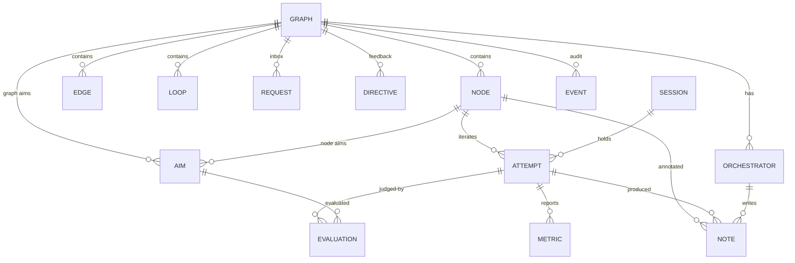

# Data model

Storage is **SQLite** (WAL mode) via **better-sqlite3** and **Drizzle ORM**. The schema lives in
`apps/server/src/db/schema.ts`, and generated migrations are committed in `apps/server/drizzle/`.
Semantics are defined in [concepts.md](concepts.md). This document defines persistence.

## Conventions

- **IDs** are prefixed ULIDs (lexicographically time-sortable): `gr_` graph, `nd_` node,
  `ed_` edge, `lp_` loop, `am_` aim, `at_` attempt, `ev_` evaluation, `mt_` metric report,
  `nt_` note, `or_` orchestrator, `se_` session, `rq_` request, `dr_` directive, `tk_` token,
  `evt_` event; optional self-evolution adds `ls_` lesson, `ld_` lesson duty, `ep_` proposal,
  `tp_` template, `es_` eval suite. Author-facing **keys** (node, loop, orchestrator, aim) are kebab-case and unique
  within their scope. The API addresses nodes as `/graphs/{graphIdOrSlug}/nodes/{nodeKey}`.
- **Times** are stored as `INTEGER` epoch milliseconds and returned by the API as ISO-8601 UTC.
- **JSON** columns are `TEXT` holding JSON (Drizzle `text({ mode: 'json' })`) and typed with the
  zod schemas from `@agent-graphs/core`.
- **Booleans** are `INTEGER` 0/1.
- **Optimistic concurrency**: mutable configuration rows (graphs, nodes, loops, orchestrators,
  aims) have `version INTEGER`. `PATCH` requires `If-Match: "<version>"` and returns `409` on
  mismatch.
- **Append-only**: `notes` (content columns), `evaluations`, `metrics`, and `events` are never
  updated or deleted. The only exception is the retraction columns on `notes`.
- **Pragmas**: `journal_mode=WAL`, `synchronous=NORMAL`, `foreign_keys=ON`, `busy_timeout=5000`.
- A single server process owns the database. All commands run in short synchronous
  transactions (better-sqlite3), so state transitions are serialized and atomic.

## Entity relationships

## Tables

### `graphs`
| Column | Type | Notes |
|---|---|---|
| `id` | TEXT PK | `gr_…` |
| `slug` | TEXT UNIQUE NULL | |
| `title`, `description` | TEXT | |
| `status` | TEXT | `draft | active | paused | verifying | completed | failed | cancelled` |
| `pending_approval` | INT | Plan approval outstanding. |
| `tags`, `constraints` | JSON | string[] |
| `repository` | JSON NULL | `{url, branch?, path?}` |
| `context` | TEXT | Shared briefing context. |
| `policy` | JSON | Fully resolved policy (defaults applied). |
| `defaults` | JSON | Node defaults. |
| `evolution` | JSON | Top-level self-evolution settings (`{ mode: 'off' }` by default). |
| `stalled` | INT | Derived flag maintained by the stall job. |
| `accepted_with_deviation` | INT | Completed through a verification escalation's `accept`. |
| `metadata` | JSON | |
| `source_spec` | JSON | Normalized spec as created (provenance). Exports are rebuilt from the tables. |
| `revision` | INT | Incremented on every structural mutation. |
| `version` | INT | Optimistic concurrency. |
| `chain_head` | TEXT | Hash of the latest event in this graph's chain. |
| `created_by` | JSON | Execution annotation. |
| `created_at`, `updated_at`, `started_at`, `completed_at`, `archived_at`, `last_activity_at` | INT | |

Indexes: `(status, archived_at)`, `(last_activity_at)`.

### `nodes`
| Column | Type | Notes |
|---|---|---|
| `id` | TEXT PK | `nd_…` |
| `graph_id` | TEXT FK | |
| `key`, `title` | TEXT | `UNIQUE(graph_id, key)` |
| `kind` | TEXT | `task | gate | milestone | group` |
| `aim`, `purpose`, `prompt`, `context` | TEXT | |
| `deliverables`, `checklist` | JSON | Definitions. Tick state lives on the attempt. |
| `aim_mode` | TEXT | `all | any` |
| `priority` | TEXT | `p0`–`p3` |
| `tags` | JSON | |
| `executor` | JSON | Recommendations plus `requires`. |
| `gate` | JSON NULL | `{approver, approverKey?, instructions?}` |
| `max_attempts`, `granted_attempts` | INT | Effective bound = `max_attempts + granted_attempts`. |
| `on_exhausted` | TEXT | |
| `lease_ttl_sec`, `timeout_sec` | INT NULL | |
| `parent_id` | TEXT NULL | Groups (M5). |
| `position` | JSON NULL | Manual layout pin `{x, y}`. |
| `metadata` | JSON | |
| `status`, `status_reason` | TEXT | |
| `activation` | INT | Starts at 1; incremented on loop reset or reopen. |
| `counted_attempts` | INT | In the current activation. |
| `attempts_total` | INT | Lifetime count. |
| `current_attempt_id` | TEXT NULL | |
| `accepted_with_deviation` | INT | |
| `version` | INT | |
| `created_at`, `updated_at`, `ready_at`, `started_at`, `completed_at` | INT | |

Indexes: `(graph_id, status)`, `(graph_id, priority)`.

### `edges`
`id` (`ed_…`), `graph_id`, `from_node_id`, `to_node_id`, `kind` (`requires | informs`), `label`,
`relation` (`leads_to | triggers | provides_input_for | converges_to`; NULL means derived from
kind), `condition`, `guidance`, `pitfalls` (TEXT, procedural knowledge;
see [self-evolution §6](self-evolution.md#6-procedural-knowledge-on-edges)), `attr_provenance`
JSON (who or what authored or appended each attribute), `version`, `created_at`, `updated_at`.
`UNIQUE(graph_id, from_node_id, to_node_id, kind)`. Indexes on `from_node_id` and
`to_node_id`.

### `loops`
| Column | Type | Notes |
|---|---|---|
| `id`, `graph_id`, `key`, `title` | | `UNIQUE(graph_id, key)` |
| `from_node_id` | TEXT | Trigger. `UNIQUE`: a node triggers at most one loop. |
| `to_node_id` | TEXT | Entry. |
| `body` | JSON | Node ids, computed and stored. |
| `max_iterations`, `granted_iterations`, `iteration` | INT | |
| `on_exhausted` | TEXT | |
| `feedback_instructions` | TEXT NULL | |
| `status` | TEXT | `idle | active | satisfied | exhausted` |
| `last_feedback` | JSON NULL | Snapshot carried into the current iteration. |
| `version`, `created_at`, `updated_at` | | |

### `aims`
| Column | Type | Notes |
|---|---|---|
| `id` | TEXT PK | `am_…` |
| `graph_id` | TEXT | |
| `owner_type`, `owner_id` | TEXT | `graph | node | orchestrator`. `UNIQUE(owner_type, owner_id, key)` |
| `key`, `title`, `description` | TEXT | |
| `kind` | TEXT | `qualitative | quantitative` |
| `terminating`, `guard` | INT | |
| `weight` | REAL NULL | |
| `metric`, `comparator`, `unit`, `source`, `aggregation` | TEXT NULL | Quantitative. |
| `target`, `target_max` | REAL NULL | |
| `criteria` | JSON NULL | Qualitative rubric. |
| `evaluator`, `evaluator_key` | TEXT NULL | |
| `sort_order` | INT | |
| `status` | TEXT | Current activation: `pending | met | unmet | partial | waived` |
| `current_value` | REAL NULL | Latest aggregated value (quantitative). |
| `last_evaluation_id` | TEXT NULL | |
| `version`, `created_at`, `updated_at` | | |

### `attempts`
| Column | Type | Notes |
|---|---|---|
| `id` | TEXT PK | `at_…` (also the capability token for attempt-scoped calls) |
| `graph_id`, `node_id` | TEXT | |
| `number` | INT | Per node, monotonic. `UNIQUE(node_id, number)` |
| `activation` | INT | |
| `status` | TEXT | `running | submitted | passed | failed | errored | blocked | abandoned | superseded | cancelled` |
| `counted` | INT | Whether it counted toward `maxAttempts`. |
| `session_id` | TEXT NULL | |
| `executor` | JSON | Execution annotation of the worker. |
| `dispatched_by` | JSON NULL | Annotation of the orchestrator that claimed on the worker's behalf. |
| `lease_expires_at` | INT NULL | Set only while `running`; cleared at submit, fail, block, or release. |
| `last_heartbeat_at` | INT NULL | |
| `progress` | INT NULL | 0–100 |
| `current_step` | TEXT NULL | |
| `checkpoint` | JSON NULL | ≤ 64 KB |
| `checklist_state` | JSON | `{[itemKey]: {done, evidence?, at, by}}` |
| `feedback_in` | JSON NULL | Exact feedback given at claim (audit). |
| `summary`, `outcome_reason` | TEXT NULL | |
| `usage` | JSON NULL | Tokens and cost, accumulated. |
| `briefing_hash` | TEXT NULL | Version of the last briefing delivered. |
| `started_at`, `submitted_at`, `ended_at` | INT | |

Indexes: `(graph_id, status)`, `(status, lease_expires_at)` for the sweeper, `(session_id)`.

### `evaluations`
`id` (`ev_…`), `graph_id`, `aim_id`, `attempt_id` (NULL for graph aims), `activation`, `verdict`
(`met | unmet | partial | waived`), `value` REAL NULL, `score` REAL NULL, `rationale`,
`evidence` JSON, `evaluator_kind` (`self | agent | orchestrator | human | system`), `actor`
JSON, `created_at`. Indexes: `(aim_id, created_at)`, `(attempt_id)`.

### `metrics`
`id` (`mt_…`), `graph_id`, `node_id` NULL, `attempt_id` NULL, `name`, `value` REAL, `unit`,
`actor` JSON, `note_id` NULL, `recorded_at`. Indexes: `(graph_id, name, recorded_at)`,
`(attempt_id, name)`.

### `notes`
| Column | Type | Notes |
|---|---|---|
| `id` | TEXT PK | `nt_…` |
| `graph_id` | TEXT | |
| `node_id`, `attempt_id`, `orchestrator_id`, `reply_to` | TEXT NULL | |
| `type` | TEXT | `proof | deliverable | finding | decision | handoff | progress | question | blocker | comment` |
| `title`, `body` | TEXT | Body ≤ 100 KB markdown. |
| `severity` | TEXT NULL | Findings only. |
| `evidence` | JSON | ≤ 50 items. |
| `metrics` | JSON NULL | Also written to `metrics`. |
| `author` | JSON | Execution annotation. |
| `relayed_by` | JSON NULL | |
| `usage` | JSON NULL | |
| `pinned` | INT | |
| `retracted_at`, `retracted_reason`, `retracted_by` | NULL | Mutable stamps (additive only). |
| `resolved_at`, `resolved_by`, `resolution_note_id` | NULL | Findings only: set by `POST /notes/{id}/resolve`. |
| `created_at` | INT | |

Indexes: `(graph_id, created_at)`, `(node_id, created_at)`, `(graph_id, type)`. Full-text search
uses the FTS5 table `notes_fts(title, body)` (external content, synced by triggers).

### `orchestrators`
`id` (`or_…`), `graph_id`, `key` (`UNIQUE(graph_id, key)`), `name`, `role`, `aim`, `purpose`,
`prompt`, `scope` JSON, `capabilities` JSON, `triggers` JSON, `executor` JSON, `metadata` JSON,
`status` (`idle | active | paused | stopped`), `session_id` NULL, `lease_expires_at`,
`last_heartbeat_at`, `version`, `created_at`, `updated_at`.

### `sessions`
`id` (`se_…`), `kind` (`agent | human | system`), `name`, `role`, `provider`, `model`,
`thinking`, `thinking_budget`, `mechanism`, `version`, `client_session_id`,
`parent_session_id` (child sessions for dispatched subagents), `token_id`, `skills` JSON (matched
against node `executor.requires`), `meta` JSON, `status`
(`active | idle | ended | lost`), `usage` JSON, `started_at`, `last_seen_at`, `ended_at`.
Indexes: `(client_session_id)`, `(status, last_seen_at)`.

### `requests`
`id` (`rq_…`), `graph_id`, `node_id` NULL, `attempt_id` NULL, `aim_id` NULL, `kind`
(`approval | question | escalation | blocker`), `subject` (`gate | aim | plan | proposal |
exhaustion | loop | guard | stall | verification | milestone | timeout | question | blocker`;
the option catalog per subject is in [concepts §11.1](concepts.md#111-requests)), `title`, `body`, `options`
JSON (`[{id, label, description?, effect}]`), `assignee` (`human | orchestrator | any`),
`assignee_key` NULL, `blocking` INT, `status` (`open | resolved | dismissed | expired`),
`created_by` JSON, `resolution` JSON NULL (`{choice, comment?, data?}`), `resolved_by` JSON NULL,
`created_at`, `resolved_at`, `expires_at` NULL. Indexes: `(status, graph_id)`, `(node_id)`.

### `directives`
`id` (`dr_…`), `graph_id`, `target_type` (`graph | node | attempt | orchestrator | session`),
`target_id`, `kind` (`guidance | change | answer | pause | resume | cancel`), `title`, `body`,
`data` JSON (for example the config diff), `requires_ack` INT, `status` (an aggregate:
`pending | delivered | acknowledged | superseded | expired`), `request_id` NULL, `supersedes`
NULL, `expires_at` NULL, `created_by` JSON, `created_at`. Index:
`(graph_id, target_type, target_id, status)`.

### `directive_deliveries`
One row per recipient: PK `(directive_id, recipient)`, where `recipient` is an attempt id or a
session id. Columns: `delivered_at`, `delivered_via` (`claim | briefing | heartbeat | hook`),
`acked_at`, `acked_by` JSON, `ack_note`. Graph-wide and persistent node directives reach many
attempts, so delivery and acknowledgment are tracked here.

### `events`
| Column | Type | Notes |
|---|---|---|
| `seq` | INTEGER PK AUTOINCREMENT | Global order. Used as the SSE `id` for `Last-Event-ID` resume. |
| `id` | TEXT UNIQUE | `evt_…` |
| `graph_id` | TEXT NULL | NULL for global events (sessions, tokens). |
| `type` | TEXT | See the catalog below. |
| `entity_type`, `entity_id` | TEXT | |
| `actor` | JSON | Execution annotation. |
| `payload` | JSON | Event-specific. Config edits include `{before, after}` for changed fields. |
| `created_at` | INT | |
| `prev_hash`, `hash` | TEXT | Hash chain (see below). |

Indexes: `(graph_id, seq)`, `(entity_type, entity_id, seq)`, `(type, seq)`.

### Supporting tables
- `api_tokens`: `id`, `name`, `role` (`admin | agent | viewer`), `token_hash` (sha256),
  `prefix` (for display), `created_by`, `created_at`, `last_used_at`, `revoked_at`.
- `idempotency_keys`: PK `(token_id, key)`, `method`, `path`, `request_hash`, `status_code`,
  `response_body`, `created_at`. Purged after 24 h. In `AUTH_MODE=local`, requests without a
  token use the sentinel `token_id = 'local'`.
- `settings`: server key/value (`key` PK, `value` JSON).
- *(M5)* `graph_revisions`: PK `(graph_id, revision)`, `spec` JSON, `summary`, `actor`,
  `created_at`.
- *(M5)* `attachments`: `id`, `graph_id`, `note_id`, `filename`, `mime`, `size`, `sha256`,
  `storage_key`, `created_by`, `created_at`. Content-addressed files live under
  `data/blobs/sha256/`.

### Self-evolution tables (optional; [self-evolution.md](self-evolution.md))
- **`lessons`** (E1): `id` (`ls_…`), `scope` JSON (graph, template, node key, edge, tags, kind, or
  global), `kind` (`guidance | pitfall | check`), `condition`, `content`, `evidence` JSON (failed
  and passed attempt ids, note ids), `source` (`worker | evolver | human | import`), counters
  `applied`, `helpful`, `harmful`, `status` (`active | retired`), `version`, `supersedes` NULL,
  `author` JSON, `created_at`, `updated_at`. Indexes on `(status)` and on the extracted scope
  keys (generated columns `scope_template`, `scope_node_key`).
- **`lesson_applications`** (E1): `(lesson_id, attempt_id)` PK, `outcome` (`passed | failed |
  pending`), `tag` (`helpful | harmful | null`, set by the evolver), `created_at`. It is written
  once per **claimed attempt** (at claim time), never for UI previews. This is the basis for the
  counters and for the with/without pass-rate statistics.
- **`lesson_duties`** (E1): `id` (`ld_…`), `graph_id`, `node_id`, `passed_attempt_id`,
  `failed_attempt_ids` JSON, `status` (`open | fulfilled | dismissed`), `lesson_id` NULL (once
  fulfilled), `assignee` (`worker | evolver`), `created_at`, `closed_at`.
- **`evolution_proposals`** (E2): `id` (`ep_…`), `target_type` (`graph | template`),
  `target_id`, `base_revision` (graph revision or template version), `ops` JSON (edit DSL),
  `canonical_hash` (non-unique index on `(target_type, target_id, canonical_hash)`; the command
  refuses a proposal whose hash matches a **rejected** one for the same target, records it as
  `refused`, and allows re-proposing edits that were committed and later reverted), `rationale`, `evidence`
  JSON, `expected_effect`, `risk_class` (`guidance | structure | protected`), `status`
  (`proposed | checking | validating | awaiting_approval | committed | rejected | refused |
  reverted`), `decision` JSON (gate inputs, scores, reasons), `committed_revision` NULL,
  `author` JSON, `created_at`, `decided_at`.
- **`evolution_validations`** (E2): `id`, `proposal_id`, `stage` (`structural | counterfactual |
  replay | ab | human`), `split` (`validation | test` NULL), `score_candidate`,
  `score_incumbent`, `samples`, `details` JSON, `judge` JSON (annotation), `created_at`.
- **`templates`** (basic, M5) and **`template_versions`** (E3). A template has `key`, `title`,
  and `current_version`. In M5 it holds a single spec that you instantiate. E3 adds versions,
  each with `spec` JSON, `parent_version`, `status` (`candidate | active | retired | rejected`),
  `scores` JSON (by split and model tier), `created_by`, and `created_at`. Graphs record
  `template_id` and `template_version`.
- **`eval_suites`**, **`eval_runs`** (E3): a suite has tasks with automatic scorers or rubric
  judges, split into `validation` and `test`. Runs record `suite_id`, `split`,
  `template_version`, `proposal_id?`, `score`, `details`, and the executor annotation.

## Event catalog

| Entity | Event types |
|---|---|
| graph | `graph.created`, `graph.updated`, `graph.revised` (structural mutation summary), `graph.started`, `graph.paused`, `graph.resumed`, `graph.verifying`, `graph.completed`, `graph.failed`, `graph.cancelled`, `graph.reopened`, `graph.archived`, `graph.unarchived`, `graph.stalled`, `graph.unstalled` |
| node | `node.created`, `node.updated`, `node.removed`, `node.status_changed` (`{from, to, reason}`), `node.reset` (`{activation, cause}`), `node.attempts_granted` |
| edge | `edge.created`, `edge.removed` |
| loop | `loop.created`, `loop.updated`, `loop.removed`, `loop.iterated` (`{iteration, feedbackSummary}`), `loop.satisfied`, `loop.exhausted`, `loop.extended` |
| aim | `aim.created`, `aim.updated`, `aim.removed`, `aim.evaluated` (`{verdict, value?, evaluatorKind}`), `aim.waived`, `aim.guard_violated` |
| attempt | `attempt.claimed`, `attempt.progress` (rate-limited), `attempt.checklist_updated`, `attempt.submitted`, `attempt.passed`, `attempt.failed`, `attempt.errored`, `attempt.blocked`, `attempt.abandoned` (`{reason: lease_expired | released}`), `attempt.superseded`, `attempt.cancelled` |
| note | `note.created`, `note.retracted`, `note.resolved` |
| metric | `metric.reported` (batched per call) |
| orchestrator | `orchestrator.created`, `orchestrator.updated`, `orchestrator.attached`, `orchestrator.detached`, `orchestrator.lease_expired`, `orchestrator.status_changed`, `orchestrator.dispatched` (`{nodeKey, attemptId, target}`) |
| session | `session.registered`, `session.updated`, `session.ended`, `session.lost`, `session.compacted` |
| request | `request.created`, `request.resolved`, `request.dismissed`, `request.expired` |
| directive | `directive.created`, `directive.delivered` (per recipient), `directive.acknowledged` (per recipient), `directive.superseded`, `directive.expired` |
| edge (attributes) | `edge.attributes_updated` (`{before, after, provenance}`) |
| lesson *(optional)* | `lesson.duty_created`, `lesson.duty_fulfilled`, `lesson.duty_dismissed`, `lesson.created`, `lesson.merged`, `lesson.revised`, `lesson.retired`, `lesson.applied`, `lesson.tagged` |
| proposal *(optional)* | `proposal.created`, `proposal.refused` (duplicate of a rejected proposal), `proposal.validated` (per stage), `proposal.approved`, `proposal.committed`, `proposal.rejected`, `proposal.reverted` |
| template / eval *(optional)* | `template.version_created`, `template.version_activated`, `template.version_retired`, `eval.run_reported` |

SSE messages use the same `type` names. Their payloads include a compact snapshot of the changed
entity, so clients can update caches without refetching.

## Hash chain

- Each graph has its own chain. Global events use the chain `global`.
- `genesis = sha256("agent-graphs:" + (graphId ?? "global"))`
- `hash = sha256(prevHash + "\n" + canonicalJson({ id, seq, graphId, type, entityType, entityId, actor, payload, createdAt }))`
  where `canonicalJson` sorts object keys recursively and uses ECMAScript number serialization
  (compatible with RFC 8785 for our value types).
- `graphs.chain_head` stores the latest hash for O(1) appends. `GET /graphs/{id}/audit/verify`
  recomputes the whole chain and reports the first mismatch, if any.

## Read models

These are computed by the server, not stored:
- **GraphSummary** (list rows): counts by node status, progress ratio, aims met/total, active
  agents, open requests, cost, `lastActivityAt`, a stalled flag.
- **GraphView** (the detail payload for the UI): graph, nodes (aims with status; current attempt
  summary with executor, progress, step, lease expiry, and heartbeat age; note counts by type;
  loop membership), edges, loops, orchestrators (status and duty-queue size), and stats.
- **NodeDetail**: the node plus aims, attempts, evaluations, notes (paginated), active
  directives, edges, and loop info.

## Migrations and backups

- drizzle-kit generates SQL migrations, which are committed. The server applies pending
  migrations on startup, after copying the database file to `data/backups/<timestamp>.sqlite`.
- `agraph db backup` uses SQLite's online backup API. `agraph db export` writes a JSONL
  dump (all tables plus the event chain) for portability.
- **Postgres** (later) keeps the same logical model: JSON → JSONB, `seq` → `BIGSERIAL`, FTS →
  `tsvector`. Repositories isolate dialect specifics.
